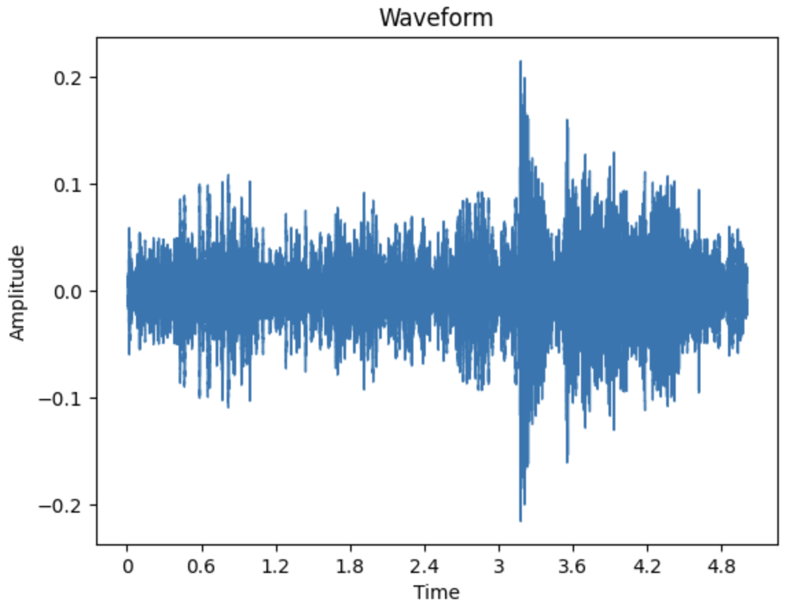
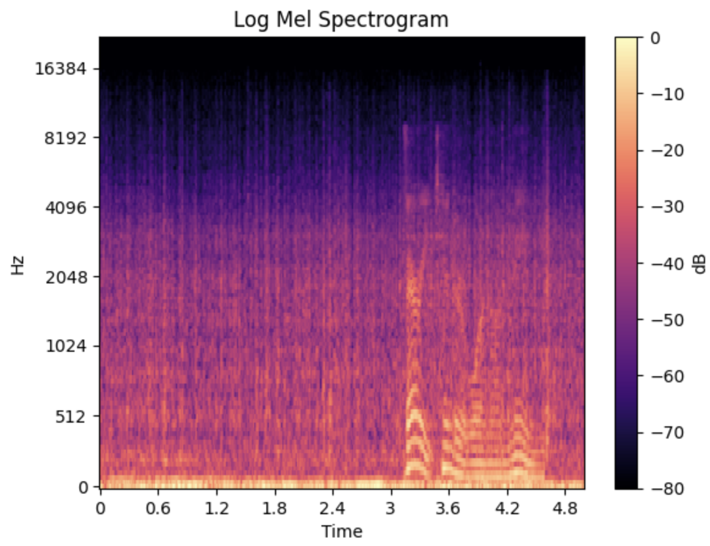
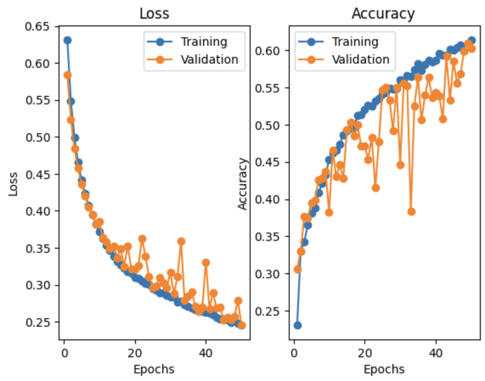

# Voice-Detection

# 🗣️ Voice Detection with Neural Networks

This project implements a **sound event detection** pipeline using neural networks, with a focus on identifying **when** speech occurs within noisy audio clips. The input is log-Mel spectrogram, and the model outputs a **sequence of binary predictions** — one per second — indicating the presence of speech.

---

## 📁 Dataset: EnvSpeech

**EnvSpeech** is a custom dataset of 5-second, 44.1kHz audio clips created by:
- Mixing environmental sounds (from ESC-50 categories) with single speech samples (from LibriSpeech)
- Each clip contains **one speech segment** embedded in noise

Each clip is accompanied by a **5-dimensional binary label**, indicating speech presence in each second of the clip:
- Example: If speech is between 1.1–1.7s → `[0, 1, 0, 0, 0]`
- If speech spans 1.5–4.5s → `[0, 1, 1, 1, 1]`

<h4>Example Waveform and Log-Mel Spectrogram Visualization:</h4>

  
  

---

## Model Architecture

- Input: Log-Mel spectrogram of shape `(128, ~216)`
- Model: Convolutional layers + linear layers
- Output: Binary predictions per second (5D vector)
- Loss: Binary Cross Entropy
- Metric: Per-frame accuracy, precision, recall, F1 score

---

## 📊 Performance Metrics

| Metric    | Value |
|-----------|-------|
| avg_per_sample_acc  | 0.884 |
| avg_exact_match_acc | 0.56 |

<h4>Loss and Accuracy Curves:</h4>

---

